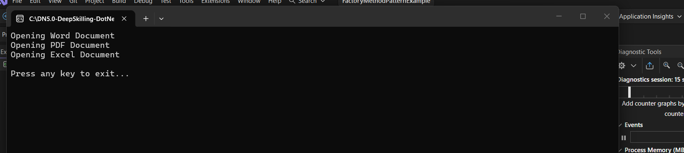

# Exercise 2: Factory Method Pattern

## Objective

Implement the Factory Method Design Pattern to create different document types without exposing object creation logic.

---
## Output



---

## Expected Output

```text
Opening Word Document
Opening PDF Document
Opening Excel Document

Press any key to exit...
```

---

## Conclusion

The Factory Method Pattern creates objects through factory classes and promotes loose coupling between object creation and usage.
