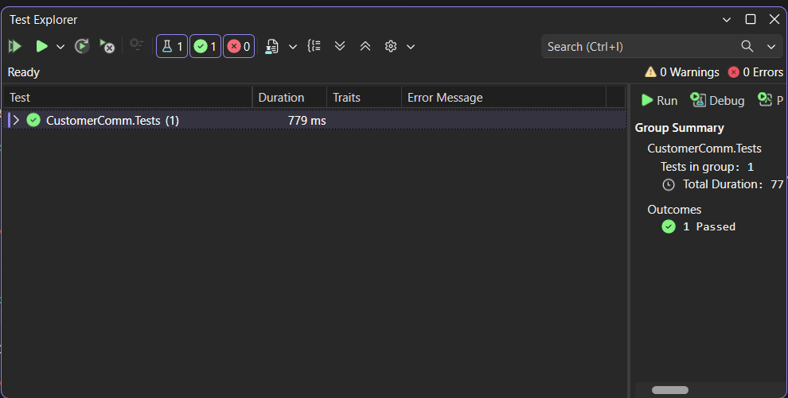
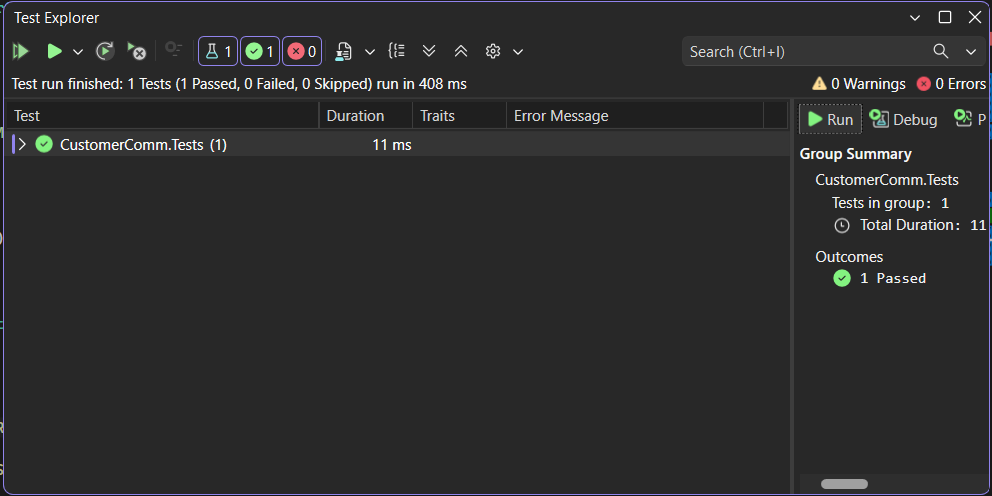

# Moq Hands-On

## Exercise 1 - Write Testable Code with Moq

### Objective
Test CustomerComm class using NUnit and Moq by mocking IMailSender.

### Features
- Mocked IMailSender using Moq
- Configured SendMail() to accept any string arguments
- Returned true using mock setup
- Verified output using Assert

### Output

---

## Exercise 2 - NUnit Attributes with Moq

### Objective
Use NUnit attributes and Moq framework for unit testing.

### Attributes Used
- TestFixture
- OneTimeSetUp
- TestCase

### Features
- Mocked IMailSender
- Configured SendMail() to return true
- Used OneTimeSetUp for initialization
- Used TestCase for test execution
- Asserted result as true

### Output
