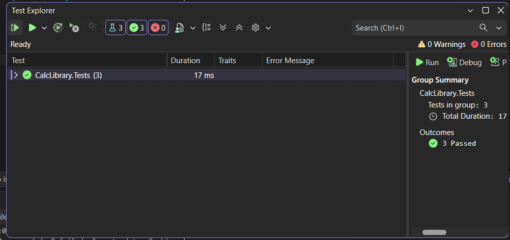

# NUnit Hands-On Exercise 1

## Objective
Validate calculator addition functionality using NUnit Framework.

## Concepts Used
- TestFixture
- SetUp
- TearDown
- TestCase
- Assert.That

## Test Cases

| Input A | Input B | Expected |
|----------|----------|----------|
| 10 | 20 | 30 |
| 5 | 5 | 10 |
| 100 | 200 | 300 |

## Result

All test cases passed successfully.

## Output

