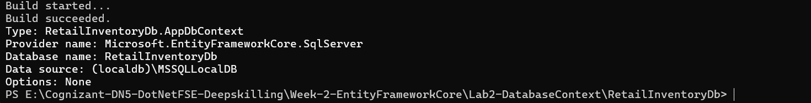
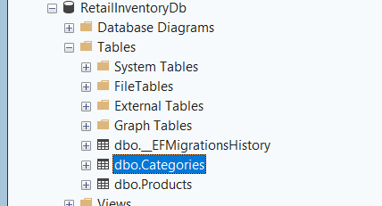

# Lab 3: Using EF Core CLI to Create and Apply Migrations

## Objective
Learn how to use EF Core CLI to manage database schema changes.

## Commands Used

```powershell
dotnet tool install --global dotnet-ef
dotnet ef migrations add InitialCreate
dotnet ef database update
```

## Migration Created

```text
InitialCreate
```

## Database Verification

Database: RetailInventoryDb

Tables Created:
- Categories
- Products

## Migration Output


## Database Update Output



## SQL Server Verification

