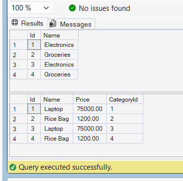

# Lab 4: Inserting Initial Data into the Database

## Objective

Use EF Core to insert records into the database using AddRangeAsync and SaveChangesAsync.

## Result

Successfully inserted:

- Electronics Category
- Groceries Category
- Laptop Product
- Rice Bag Product

## Application Output

## SQL Server Verification

