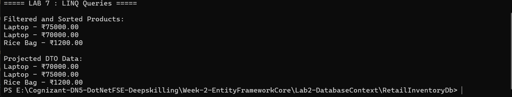
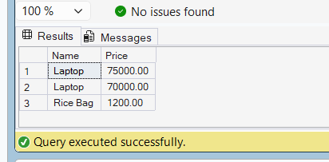

# Lab 7: Writing Queries with LINQ

## Objective

Use LINQ queries with Entity Framework Core to:

- Filter records using Where()
- Sort records using OrderByDescending()
- Project data using Select()

## Application Output

## SQL Server Verification

