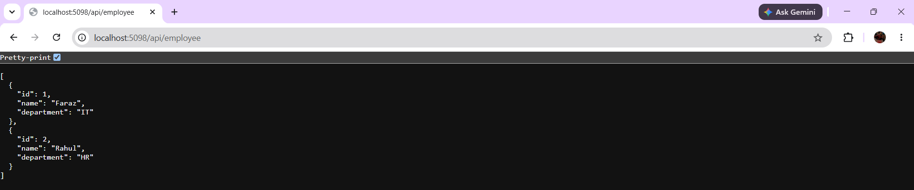
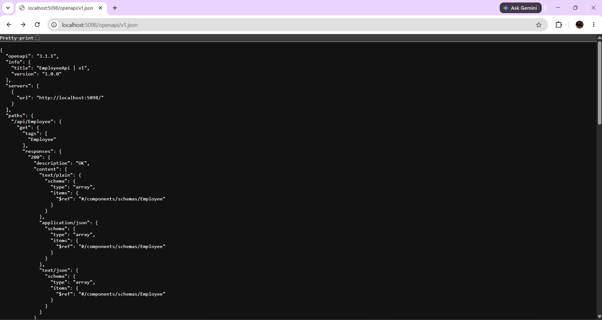

# Web API Hands-On 2: Creating Employee API

## Objective

Create a simple ASP.NET Core Web API that returns employee details using a controller.

## Project Structure

- Employee Model
- Employee Controller
- GET API Endpoint
- OpenAPI Documentation

## API Endpoint

```http
GET /api/employee
```

## Sample Response

```json
[
  {
    "id": 1,
    "name": "Faraz",
    "department": "IT"
  },
  {
    "id": 2,
    "name": "Rahul",
    "department": "HR"
  }
]
```

## Employee API Output



## OpenAPI Documentation Output

.NET 10 uses built-in OpenAPI support.



## Technologies Used

- ASP.NET Core Web API
- .NET 10
- OpenAPI
- C#

## Result

Successfully created and tested a Web API that returns employee information through a GET endpoint.