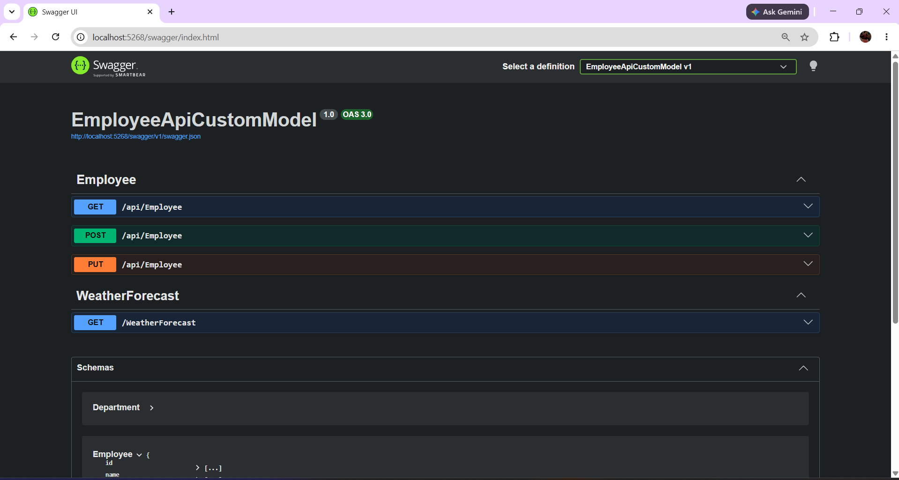
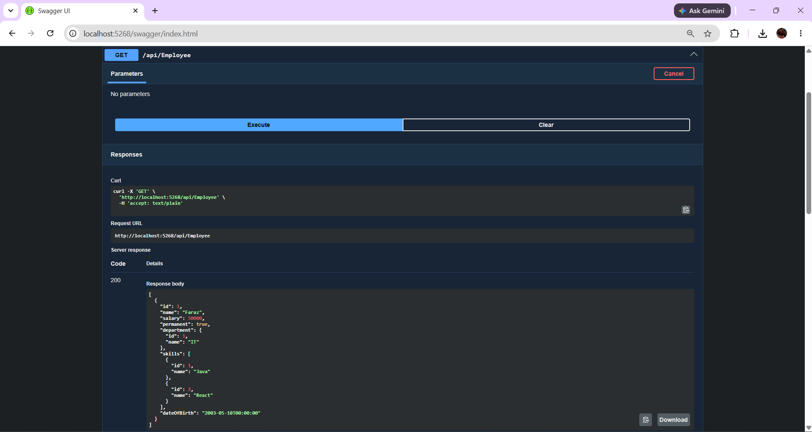
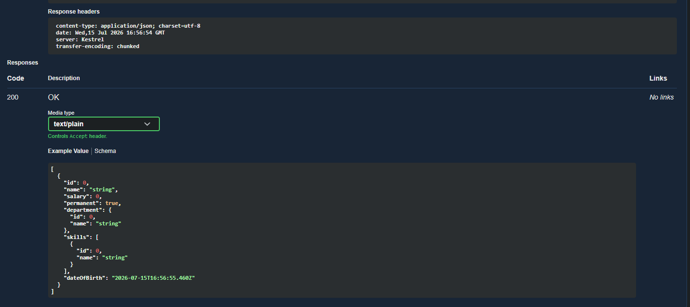
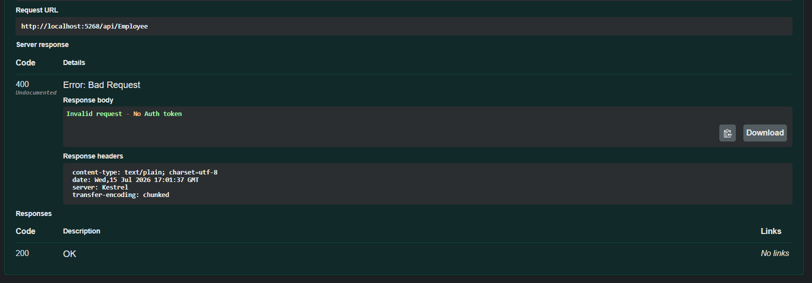

# Web API Hands-On 3: Custom Model Class and Custom Action Filter

## Objective

- Create custom Employee model
- Use AllowAnonymous attribute
- Use HttpGet action method
- Use FromBody attribute
- Implement Custom Authorization Filter
- Demonstrate ActionFilterAttribute and OnActionExecuting

## Swagger Home

## GET Employee Output

## GET Success Status Code (200)

## Custom Authorization Filter

## Result

Successfully implemented Employee API with custom model classes, FromBody attribute, AllowAnonymous attribute, ProducesResponseType attribute and Custom Authorization Filter.