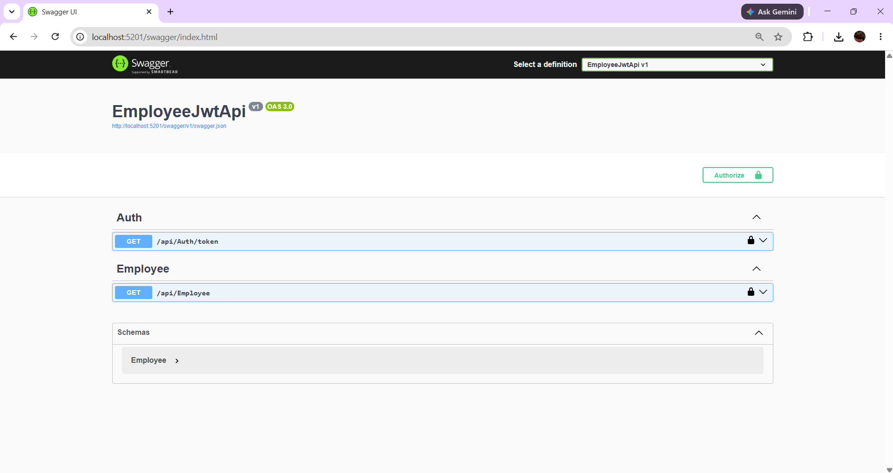
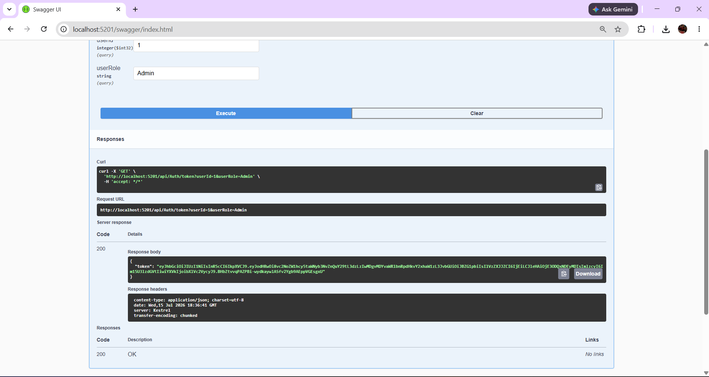
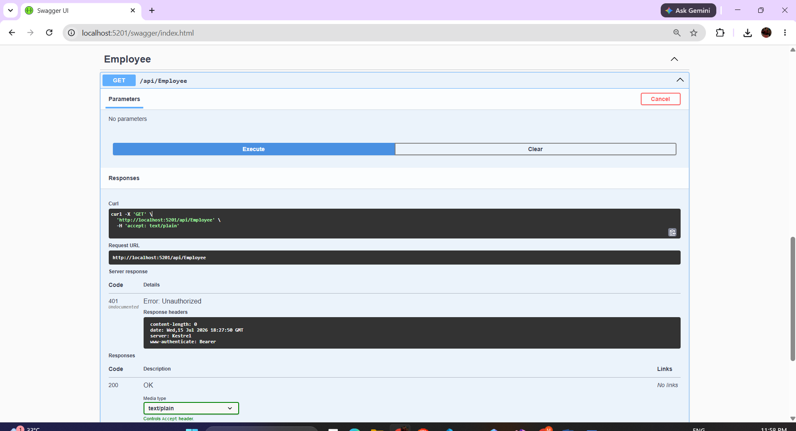
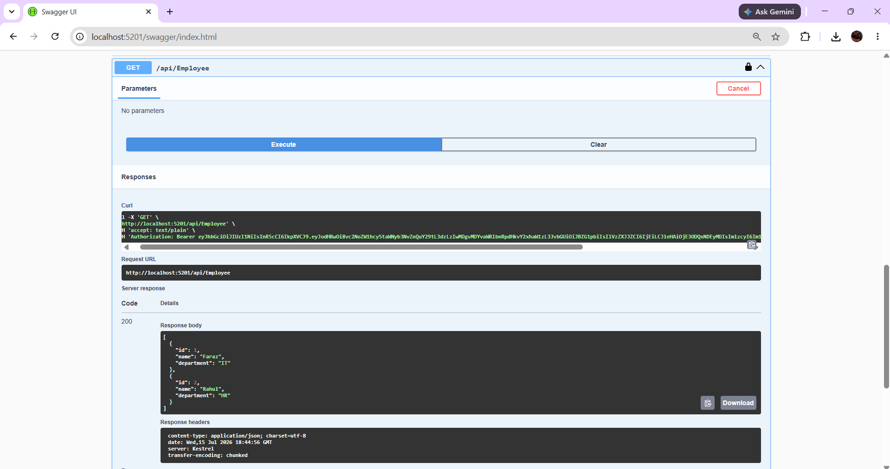

# Web API Hands-on 5 – JWT Authentication and CORS

## Objective

This hands-on demonstrates:

- Creating a secured ASP.NET Core Web API using JWT Authentication.
- Generating JWT tokens using an authentication controller.
- Protecting API endpoints using the Authorize attribute.
- Configuring CORS policy in ASP.NET Core Web API.
- Testing secured endpoints using Swagger UI.

## Project Structure

```text
Week-3-ASPNET-Core-WebAPI
└── 5.WebApi_Handson
    └── EmployeeJwtApi
```

## Technologies Used

- ASP.NET Core Web API (.NET 8)
- JWT Bearer Authentication
- Swagger/OpenAPI
- CORS Policy
- Visual Studio 2022

## Features Implemented

### Authentication API

```http
GET /api/Auth/token
```

Generates a JWT token containing UserId and Role claims.

### Employee API

```http
GET /api/Employee
```

Protected endpoint accessible only with a valid JWT token.

### CORS Configuration

Configured to allow:

- Any Origin
- Any Header
- Any Method

## JWT Configuration

Issuer:

```text
mySystem
```

Audience:

```text
myUsers
```

## Screenshots

### Swagger Home Page



### JWT Token Generated



### Unauthorized Access



### Employee Data With JWT Authentication



## Sample Employee Response

```json
[
  {
    "id": 1,
    "name": "Faraz",
    "department": "IT"
  },
  {
    "id": 2,
    "name": "Rahul",
    "department": "HR"
  }
]
```

## Learning Outcome

Successfully implemented:

- JWT Authentication
- Authorization using Authorize Attribute
- Swagger JWT Integration
- Token Generation and Validation
- CORS Policy Configuration
- Secure Web API Development