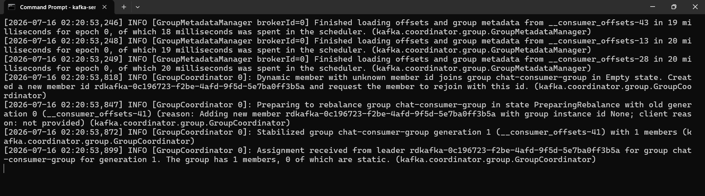
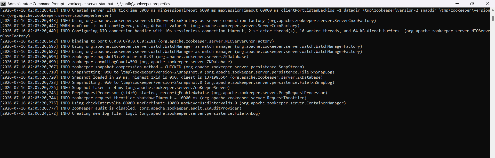
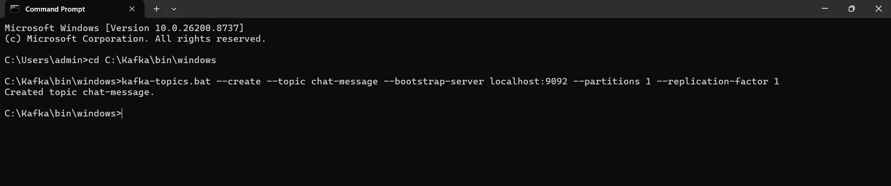
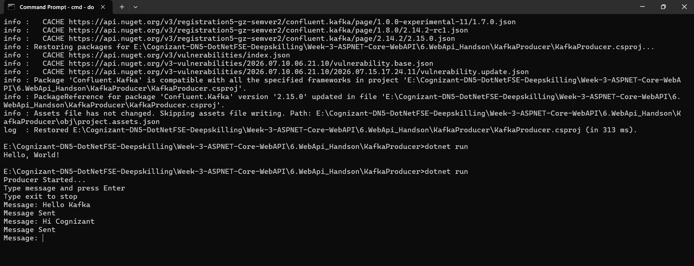
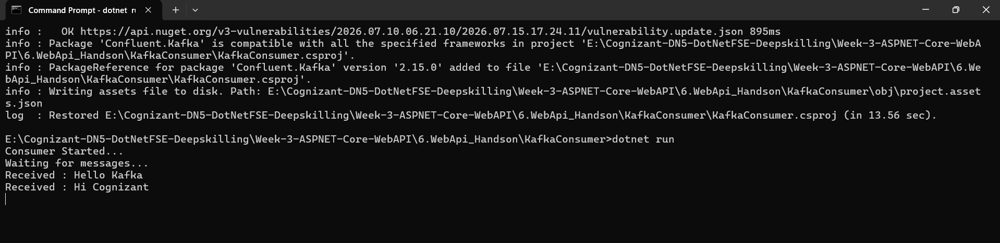

# Kafka Integration with C#


## Overview


This hands-on demonstrates the integration of Apache Kafka with .NET using C#. A simple chat application was developed where messages are published by a Producer application and consumed by a Consumer application through Kafka topics.


## Topics Covered


- Introduction to Kafka

- Kafka Architecture

- Topics

- Partitions

- Brokers

- Kafka Integration with .NET

- Kafka Installation

- ZooKeeper Basics

- Producer and Consumer Communication


---


# Hands-On 1


## Chat Application using Kafka


A console-based chat application was created using Apache Kafka as the streaming platform.


The Producer application publishes messages to a Kafka topic.


The Consumer application subscribes to the same topic and receives messages in real time.


---


# Project Structure


```text

6.WebApi_Handson

│

├── KafkaConsumer

│   ├── KafkaConsumer.csproj

│   └── Program.cs

│

├── KafkaProducer

│   ├── KafkaProducer.csproj

│   └── Program.cs

│

├── consumer-started.png

├── kafka-broker-running.png

├── kafka-topic-created.png

├── producer-started.png

├── zookeeper-running.png

│

└── README.md

```


---


# Kafka Server Running


Apache Kafka Broker was successfully started and is running on localhost:9092.





---


# ZooKeeper Running


ZooKeeper service was successfully started and configured to coordinate Kafka broker operations.





---


# Kafka Topic Created


A Kafka topic named `chat-message` was successfully created.


```bash

kafka-topics.bat --create --topic chat-message --bootstrap-server localhost:9092 --partitions 1 --replication-factor 1

```





---


# Producer Application


The Producer application sends messages to the Kafka topic.


Messages entered by the user are published to the topic.





---


# Consumer Application


The Consumer application subscribes to the topic and receives messages sent by the Producer.





---


# Producer and Consumer Communication


### Sample Messages


```text

Hello Kafka

Hi Cognizant

```


### Consumer Output


```text

Received : Hello Kafka

Received : Hi Cognizant

```


This demonstrates successful communication between Producer and Consumer through Apache Kafka.


---


# Commands Used


## Start ZooKeeper


```cmd

zookeeper-server-start.bat ..\..\config\zookeeper.properties

```


## Start Kafka Broker


```cmd

kafka-server-start.bat ..\..\config\server.properties

```


## Create Topic


```cmd

kafka-topics.bat --create --topic chat-message --bootstrap-server localhost:9092 --partitions 1 --replication-factor 1

```


## Run Consumer


```cmd

dotnet run

```


## Run Producer


```cmd

dotnet run

```


---


# Result


Apache Kafka was successfully configured and integrated with .NET 8.


A Kafka topic named `chat-message` was created successfully.


Messages sent from the Producer application were successfully received by the Consumer application.


Hence, Kafka-based message communication was implemented successfully.