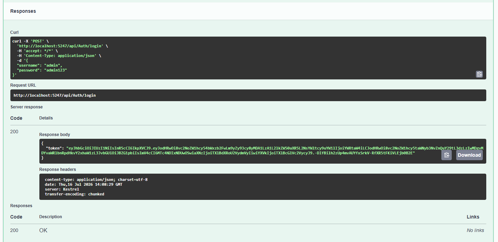
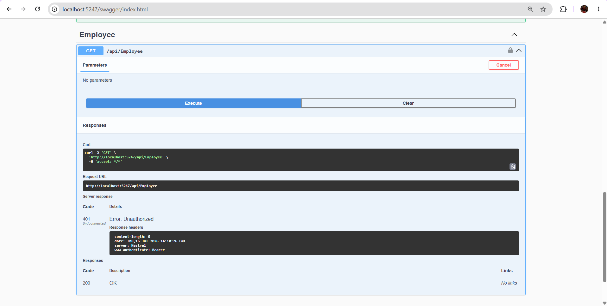
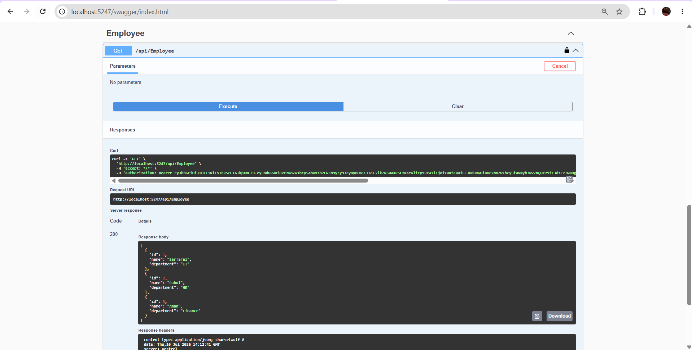

# JWT Authentication in ASP.NET Core Web API

## Objective
Implement JWT Authentication and Authorization in ASP.NET Core Web API.

## Features
- User Login API
- JWT Token Generation
- Protected Endpoint using Authorize Attribute
- Swagger Testing Support

## Technologies
- ASP.NET Core 8 Web API
- JWT Bearer Authentication
- Swagger

## Endpoints

### Login API

**POST /api/Auth/login**

Request:

```json
{
  "username": "admin",
  "password": "admin123"
}
```

---

## Login Success



---

## Unauthorized Access



---

## JWT Token Authorization


---

## Protected Employee Endpoint



---